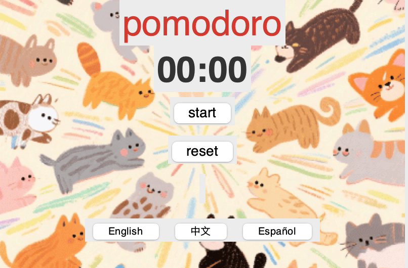
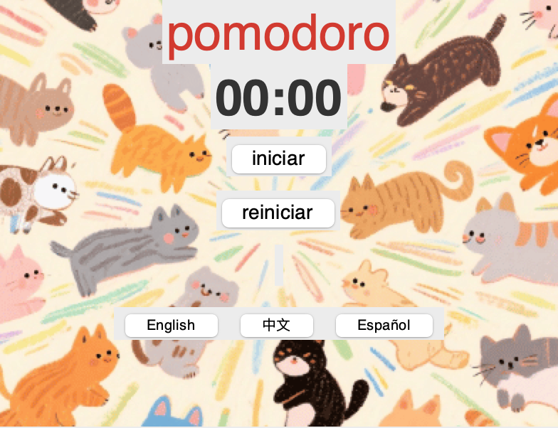
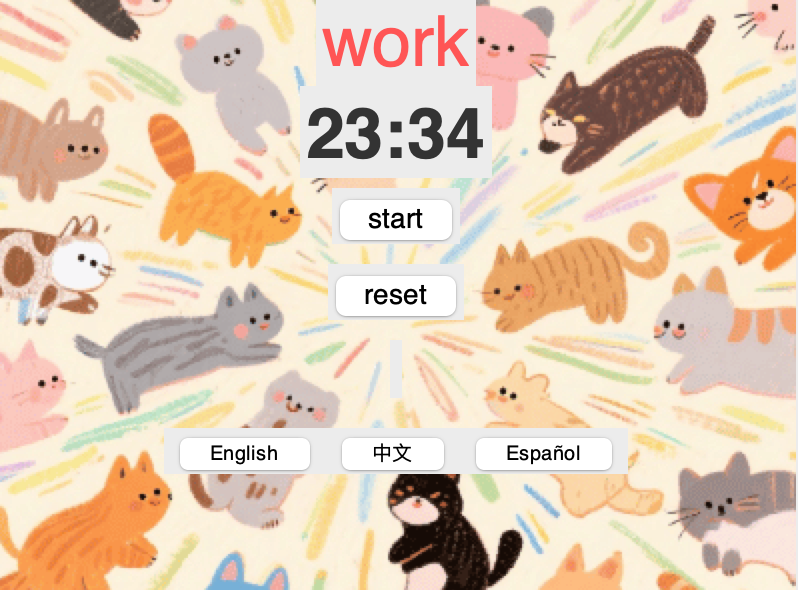

# Pomodoro Clock

## What Is This Project?
The Pomodoro Clock is a simple timer based on the Pomodoro Technique, a time-management method that uses:

- **25-minute focus sessions**
- **5-minute short breaks**
- **A longer break after four cycles**

This system helps maintain focus, reduce burnout, and make large tasks feel manageable.

## Features
- Very simple (only countdown function)
- Very cute
- Support three languages: English, Mandarin, Spanish

## Requirements

To run the code in this repository, you only need:

- **Python 3.10**
- **PyCharm 2025.2.3**

## How to Run the Code
### 1. Open the Project
- Launch **PyCharm**
- Go to **File → Open**
- Select your project folder: 'final work'

### 2. Open the Main File

- In the Project panel, find and open main.py

### 3. Run the File

Choose any method:

- Right-click **main.py** → *Run 'main'*
- Click the **green ▶ Run button**
- Top menu → **Run → Run…** → select *main*

### 4. View Output

A Run window will appear at the bottom of PyCharm showing:

- Timer output
- Any error messages

## Expected Output
- Main Timer in English

- Main Timer in Mandarin

- Main Timer in Spanish

- Countdown Example

## Presentation Recording
- Last about 5 minutes long
- Introduce the pomodoro timer theory
- Talk about prototypes and design flow
- Break down the codes
- Demo the software and mention its technical features

**English Version:**  
https://www.youtube.com/watch?v=w-N68J6E938

**Mandarin Version:**  
https://www.youtube.com/watch?v=1_kMT7EsG4g