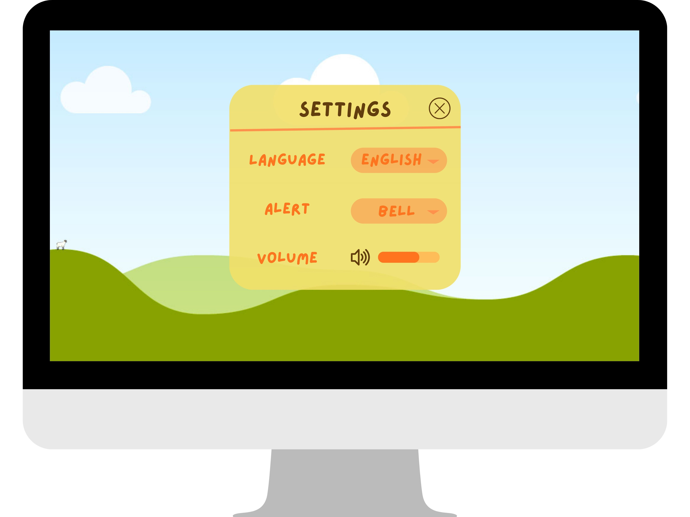
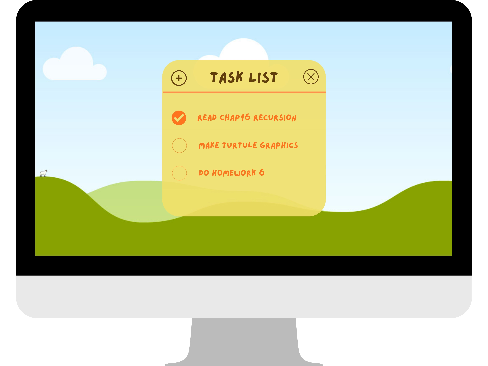

# Pomodoro Timer

## 1. Main Timer Screen
This screen shows the timer countdown and primary controls (start, pause).

**Sketch**

---

## 2. Settings Screen
This screen allows users to change languages, alart type, and volume.

**Sketch**

---

## 3. Task List Screen
This screen allows users to add or select tasks to work on during Pomodoro sessions.

**Sketch**

---

## Online Prototype 

**canvas link:** https://www.canva.com/design/DAG5ZOmLwkQ/kVvbGEDXzFnIYtIaRAHWYw/edit?utm_content=DAG5ZOmLwkQ&utm_campaign=designshare&utm_medium=link2&utm_source=sharebutton 

---

## Notes
- The prototype is intentionally low-fidelity to focus on structure and flow.
- The final UI may differ once we develop the high-fidelity version.